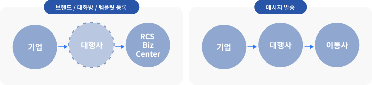
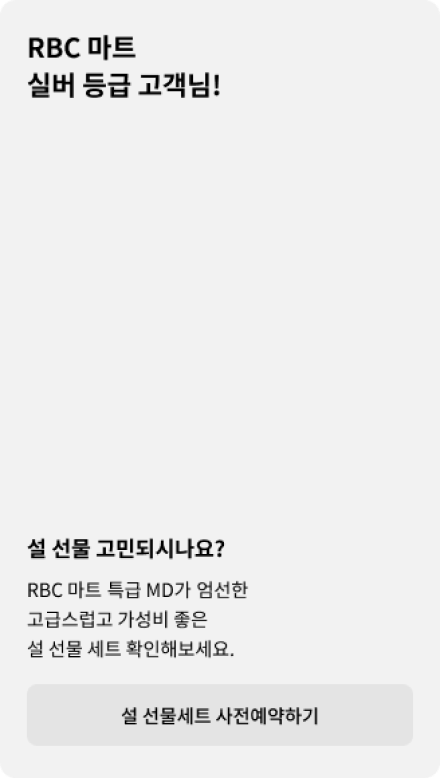

# 서비스 구조

## 1. 서비스 구조

기업 담당자는 RBC에서 직접 또는 대행사를 통하여 브랜드를 등록/관리할 수 있습니다.

RCS 기업 메시지 또한 지정한 대행사를 통하여 발송할 수 있습니다.

<figure><figcaption></figcaption></figure>

```

테스트 테스트

```

<figure><figcaption></figcaption></figure>

